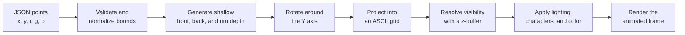

# ASCII Animated 3D Renderer

Turn colored 2D point-cloud data into animated 3D ASCII art directly in the browser. The project combines a reusable Web Component with an interactive editor for loading, painting, previewing, and exporting point data.

**[View the live renderer](https://mohammds.github.io/ascii-animated-3d-renderer/)** · **[Open the point-cloud editor](https://mohammds.github.io/ascii-animated-3d-renderer/editor.html)**

[](https://mohammds.github.io/ascii-animated-3d-renderer/)

## Explore the project

| Demo | What it shows |
| --- | --- |
| [Animated renderer](https://mohammds.github.io/ascii-animated-3d-renderer/) | Automatic coordinate normalization, shallow 3D extrusion, rotation, colored ASCII lighting, and multiple datasets rendered by the same component. |
| [Point-cloud editor](https://mohammds.github.io/ascii-animated-3d-renderer/editor.html) | JSON upload, included presets, point and ASCII views, painting, erasing, undo/redo, view fitting, background selection, and JSON export. |
| [Abstract dataset](./examples/abstract-diamond.json) | A small generic example using coordinates from `-40` to `40`. |
| [University of Haifa datasets](./examples/) | The original artwork that inspired the project, now used as example data for the generalized renderer. |

## What the project demonstrates

- A reusable `<ascii-point-cloud>` custom element built with native Web Components
- Conversion of colored 2D coordinates into a shallow animated 3D point cloud
- Y-axis rotation, orthographic projection, z-buffer visibility, depth lighting, and configurable ASCII shading
- Automatic centering and scaling for datasets that use different coordinate ranges
- A browser-based Canvas editor for creating and modifying compatible point data
- Responsive rendering, reduced-motion support, error handling, and accessible image labels
- No framework, build step, backend, or runtime dependency

The project began as an experiment for rendering University of Haifa logo data. Its rendering logic was then generalized so the same component and editor can accept any compatible colored point set.

## Rendering pipeline



Each source point has the form `[x, y, r, g, b]`. The renderer calculates the dataset bounds, centers the coordinates, and normalizes their scale while preserving the original aspect ratio.

To create the 3D effect, the implementation generates a shallow front surface, a partial back surface, and intermediate points around detected rim cells. Every frame rotates those points around the Y axis and projects them into a fixed character grid. A z-buffer keeps the nearest point in each grid cell, while calculated depth controls the ASCII character and RGB brightness.

## Technical implementation

### Web Component renderer

The renderer is implemented in [`src/ascii-point-cloud.js`](./src/ascii-point-cloud.js) as a native custom element with an open Shadow DOM.

- `ResizeObserver` adjusts the character size when the component changes dimensions.
- Point data is fetched from the `src` URL, validated, normalized, and cached by source and depth.
- Typed arrays store character indices, colors, and z-buffer values for each frame.
- The final colored frame is rendered into a semantic `<pre role="img">` element.
- `prefers-reduced-motion`, `paused`, and `motion` control animation behavior.
- Attribute changes can reload the artwork or restart rendering without recreating the component.

The original `<haifa-logo-ascii>` element remains available through [`src/haifa-logo-ascii.js`](./src/haifa-logo-ascii.js) as a backward-compatible wrapper.

### Point-cloud editor

The editor uses native Canvas APIs and is implemented in [`src/point-cloud-editor.js`](./src/point-cloud-editor.js).

- Source coordinates are converted through a reversible model-to-canvas transform.
- The view automatically fits the loaded dataset while retaining its original coordinate scale for export.
- High-DPI canvases are capped at a device-pixel ratio of `2` for clarity and predictable performance.
- Point mode draws the original RGB coordinates directly.
- ASCII mode builds an editable character-grid preview from the same point data.
- Each completed stroke becomes an undoable history entry.
- Imported files remain local to the browser, and export creates a new JSON download without overwriting the source.

### Data validation and rendering safety

Both tools require a non-empty JSON array. Every point must contain exactly five finite numbers. The editor rejects RGB channels outside `0-255`, while the renderer clamps channels into that range before drawing.

The renderer also tracks asynchronous requests so an older response cannot replace a more recently selected dataset.

## Use the renderer

Import the module and provide a JSON source:

```html
<script type="module" src="./src/ascii-point-cloud.js"></script>

<ascii-point-cloud
  src="./examples/university-of-haifa-old.json"
  label="Animated ASCII point cloud"
  speed="1"
  depth="0.05"
  fps="18"
  columns="132"
  rows="48"
></ascii-point-cloud>
```

### Component attributes

| Attribute | Default | Purpose |
| --- | --- | --- |
| `src` | Required | URL of the point-cloud JSON file |
| `label` | Generic label | Accessible description for the rendered artwork |
| `speed` | `1` | Rotation speed and direction; negative values reverse it |
| `depth` | `0.05` | Shallow extrusion depth between `0.02` and `0.5` |
| `fps` | `18` | Animation rate between 1 and 30 FPS |
| `columns` | `132` | ASCII grid width between 30 and 240 |
| `rows` | `48` | ASCII grid height between 16 and 100 |
| `ramp` | Built-in ramp | Characters ordered from light to dense |
| `paused` | Off | Presence of the attribute pauses animation |
| `motion="always"` | Off | Animates even when reduced motion is enabled |

CSS custom properties control the host surface:

```css
ascii-point-cloud {
  --ascii-cloud-background: #07111f;
  --ascii-cloud-radius: 1rem;
  --ascii-cloud-aspect: 3 / 1;
}
```

## Point-data format

Each JSON file contains a non-empty array of points:

```json
[
  [0.0, 0.0, 60, 181, 231],
  [0.1, 0.2, 255, 255, 255]
]
```

Each point is `[x, y, r, g, b]`:

- `x`, `y`: finite coordinates in any consistent 2D scale
- `r`, `g`, `b`: RGB color channels between `0` and `255`

The renderer normalizes coordinates for display. The editor retains the source coordinate system so exported files remain compatible with the original dataset.

## Use the editor

Open [`editor.html`](./editor.html) or use the [hosted editor](https://mohammds.github.io/ascii-animated-3d-renderer/editor.html):

1. Select an included example or upload a local JSON file.
2. Switch between raw point and ASCII views.
3. Choose a background, point color, brush size, and add/remove tool.
4. Paint, erase, undo, redo, reset, or fit the view.
5. Export the edited point data as a new JSON file.

Right-click temporarily activates the remove tool regardless of the selected mode.

## Run locally

The project loads JavaScript modules and JSON files, so serve the repository over HTTP:

```bash
python -m http.server 8000
```

Then open:

- Renderer: http://127.0.0.1:8000/
- Editor: http://127.0.0.1:8000/editor.html

## Project structure

```text
ascii-animated-3d-renderer/
|-- index.html
|-- editor.html
|-- point-cloud-editor.html
|-- README.md
|-- src/
|   |-- ascii-point-cloud.js
|   |-- haifa-logo-ascii.js
|   `-- point-cloud-editor.js
|-- styles/
|   `-- point-cloud-editor.css
|-- examples/
|   |-- abstract-diamond.json
|   |-- university-of-haifa-old.json
|   `-- university-of-haifa-new.json
`-- assets/
    |-- logo-preview.gif
    `-- cloud-points-editor.png
```

## Built with

Native HTML, CSS, JavaScript, Canvas, Web Components, Shadow DOM, typed arrays, and GitHub Pages.
