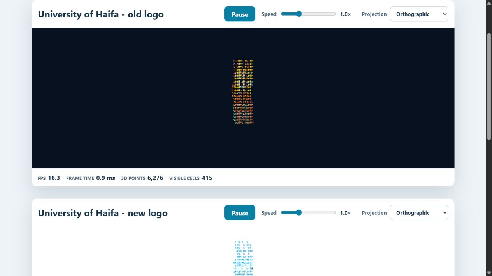
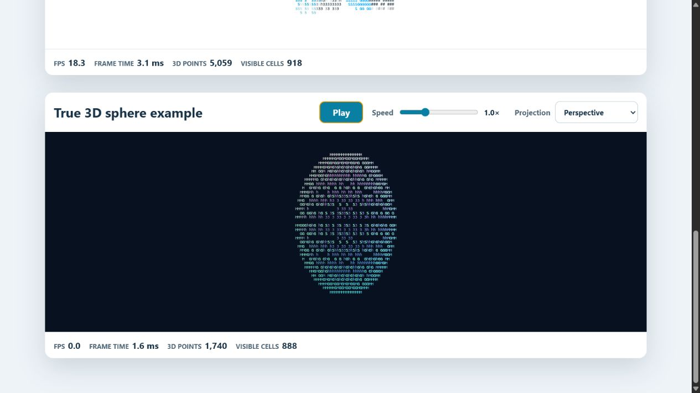

# 3D ASCII Logo Previews

I made this as a small university computer graphics project. The idea is to take true 3D point-cloud data, rotate it in JavaScript, and render it as colored ASCII art in the browser.

The project currently includes two logo previews and a true 3D shape example:

- University of Haifa - old logo
- University of Haifa - new logo
- Sphere

It also includes a small point-cloud editor/viewer so I can inspect, paint, erase, and export the JSON point data used by the previews.

## How To Run

This project should be opened through a local server, not by double-clicking `index.html`.

The reason is that the page loads JavaScript modules and JSON files with `fetch()`. Browsers often block those requests when the page is opened directly from `file://`.

Python is only used here to start a simple static file server. The rendering, animation, editor, and math logic are all implemented in HTML and JavaScript and run inside the browser.

From the project folder, run:

```bash
python -m http.server 8000
```

Then open:

```text
http://127.0.0.1:8000/index.html
```

## What Each Page Does

`index.html`

This is the main preview page. It shows the two animated ASCII logo previews, a sphere example, interactive playback controls, live rendering statistics, and a link to the point-cloud editor.



Each preview has:

- **Play / Pause**: stops or resumes that preview without affecting the others.
- **Speed**: changes the Y-axis rotation speed from `0.1x` to `3.0x`.
- **Projection**: switches independently between orthographic and perspective projection.
- **FPS**: the renderer's measured frames per second.
- **Frame time**: how long the most recent ASCII frame took to build.
- **3D points**: the number of source points processed per frame.
- **Visible cells**: the number of ASCII cells that survived projection and depth testing.

The sphere preview demonstrates the true 3D point format and the perspective projection mode:



`point-cloud-editor.html`

This is the editor/viewer page. I use it to load a logo point-cloud JSON file, view the raw points, view an ASCII-style render, add points, remove points, undo/redo edits, reset, and export the edited JSON.


## How to Use The Point-Cloud Editor

The point-cloud editor is a browser tool for editing the JSON data files that already live in the repo folder.

When I open `point-cloud-editor.html`, the **Logo** dropdown loads one of the existing point-cloud files from the `data/` folder:

- `data/haifa-logo-points.json` for the University of Haifa - old logo
- `data/second-logo-points.json` for the University of Haifa - new logo

The editor loads those files with `fetch()`, draws the points on the canvas, and lets me inspect the logo as either raw cloud points or an ASCII-style render.

The main controls are:

- **Logo**: switches between the old logo JSON and the new logo JSON.
- **Load JSON**: lets me inspect a local JSON file from my computer.
- **View**: switches between point-cloud view and ASCII render view.
- **Tool**: chooses whether I am adding points or removing points.
- **Point color**: sets the RGB color for new points.
- **Point depth**: sets the Z coordinate for new points.
- **Brush size**: controls how many points I add or remove at once.
- **Undo / Redo**: steps backward or forward through edits.
- **Reset**: returns to the currently loaded JSON data.
- **Export JSON**: downloads the edited point-cloud data as a new `.json` file.

The editor does not automatically overwrite files in the repository. After exporting, manually replace the matching JSON file in the repo folder with the downloaded file:

- replace `data/haifa-logo-points.json` if I edited the old logo
- replace `data/second-logo-points.json` if I edited the new logo

After replacing the file, I can refresh `index.html` through the local server to preview the updated ASCII logo.

## What Each File Does

The repo is organized like this:

```text
haifa-logo-ascii-3d/
|-- index.html
|-- point-cloud-editor.html
|-- README.md
|-- src/
|   |-- haifa-logo-ascii.js
|   |-- logo-demo-controls.js
|   `-- point-cloud-editor.js
|-- styles/
|   `-- point-cloud-editor.css
|-- data/
|   |-- haifa-logo-points.json
|   |-- second-logo-points.json
|   `-- sphere-points.json
|-- scripts/
|   `-- build-3d-point-data.mjs
`-- assets/
    |-- logo-preview.gif
    |-- interactive-controls-stats.png
    |-- perspective-sphere.png
    `-- cloud-points-editor.png
```

`src/haifa-logo-ascii.js`

This is the main renderer. It defines the custom HTML element:

```html
<haifa-logo-ascii></haifa-logo-ascii>
```

It loads true 3D point data, spins the points around the Y axis, projects them into a 2D ASCII grid, colors the characters, and writes the final result into a `<pre>` element.

After drawing, it emits a `renderstats` event with FPS, frame time, source-point count, visible-cell count, frame number, and playback state.

`src/logo-demo-controls.js`

This connects each preview's Play/Pause button and speed slider to its renderer attributes, then displays the live data from `renderstats`.

`data/haifa-logo-points.json`

This contains the point-cloud data for the University of Haifa - old logo.

`data/second-logo-points.json`

This contains the point-cloud data for the University of Haifa - new logo.

All point-data files use this true 3D format:

```js
[x, y, z, r, g, b]
```

Where:

- `x`, `y`, and `z` are the 3D point position
- `r`, `g`, and `b` are the point color

`data/sphere-points.json`

This is a generated spherical point cloud that demonstrates that the renderer is not limited to shallow logo extrusions.

`scripts/build-3d-point-data.mjs`

This reproducibly builds the stored Z coordinates for legacy 2D logo data and generates the sphere example. The browser renderer does not generate depth at runtime.

`src/point-cloud-editor.js`

This powers the editor. It loads JSON point files, draws them on a canvas, lets me add/remove points, and exports updated JSON.

`styles/point-cloud-editor.css`

This styles the editor page.

## Methodology

My pipeline is:

1. Start with a colored point cloud containing X, Y, and Z coordinates.
2. Rotate the points around the Y axis.
3. Project the rotated points onto a 2D ASCII grid.
4. Use a z-buffer so the front-most point wins when multiple points land on the same cell.
5. Convert brightness into ASCII characters.
6. Render the final colored ASCII frame into a `<pre>`.
7. Repeat the process on a timer to create animation.

## True 3D Point Data

Depth is part of every stored point instead of being generated by the renderer. This keeps point-data creation separate from rendering and lets the same component display arbitrary 3D geometry.

For example, a point from the logo data looks like:

```js
[x, y, z, r, g, b]
```

The included build script migrates the original logo samples into shallow 3D extrusions and generates a sphere directly from latitude and longitude. Both reach the renderer through the same six-number point format.

## Rotation Math

I rotate only around the Y axis. I intentionally removed X-axis tilt so the logo stays upright.

The angle is based on the frame number:

```js
const angleY = frameIndex * 0.052 * Math.abs(rotationSpeed);
```

For every point, I rotate `x` and `z`:

```js
const x2 = x * cosY + z * sinY;
const z2 = -x * sinY + z * cosY;
```

This is the standard Y-axis rotation formula.

## Projection Math

The renderer supports two projection modes. Orthographic is the default and keeps the original point-cloud scale regardless of depth:

```js
const sx = Math.trunc(COLUMNS / 2 + x2 * scale * 1.18);
const sy = Math.trunc(ROWS / 2 - y * scale * 0.92);
```

Perspective mode scales X and Y according to the point's distance from a virtual camera:

```js
const perspectiveScale = CAMERA_DISTANCE / (CAMERA_DISTANCE - z2);
const sx = Math.trunc(COLUMNS / 2 + x2 * scale * 1.18 * perspectiveScale);
const sy = Math.trunc(ROWS / 2 - y * scale * 0.92 * perspectiveScale);
```

In both modes:

- rotated `x2` controls horizontal screen position
- original `y` controls vertical screen position
- rotated `z2` controls depth sorting and lighting
- in perspective mode, `z2` also makes nearer points appear larger and farther points appear smaller

## Z-Buffer

When more than one point lands on the same ASCII cell, I keep only the point closest to the viewer.

```js
if (z2 <= zBuffer[index]) continue;
zBuffer[index] = z2;
```

This is what makes the rotating logo feel more like a 3D object instead of a flat pile of points.

## ASCII Shading

I use a character ramp from light to dense:

```js
const RAMP = " .,:;irsXA253hMHGS#9B&@";
```

After calculating a light value, I choose a character from that ramp:

```js
chars[index] = Math.trunc(light * (RAMP.length - 1));
```

Then I color each character using the original point color, slightly shaded by depth.

## Why I Used `<pre>`

I originally tested rendering approaches with canvas and generated frames. The current preview renders into a `<pre>` because it makes the ASCII output real text-like content and keeps the final effect closer to the idea of ASCII art.

Each frame is rebuilt as colored `<span>` elements inside the `<pre>`.

## Notes

This is not a full 3D engine. It is a small graphics experiment focused on:

- true 3D point-cloud representation
- reusable geometry input
- Y-axis rotation
- orthographic and perspective projection
- z-buffer visibility
- ASCII shading
- browser-based interaction

That was the goal of the project: keep the math understandable, make the animation visible, and keep the data editable.
